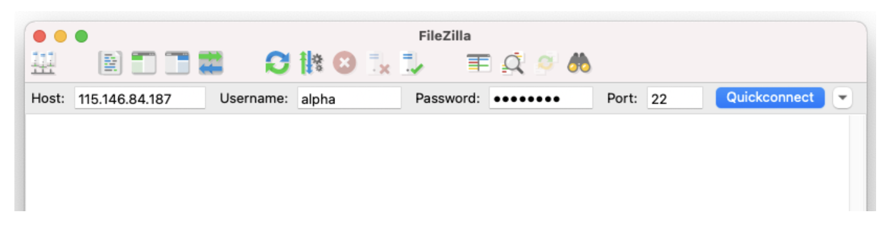

::: questions
-   How do you write a lesson using R Markdown and `{sandpaper}`?
:::

::: objectives
-   Explain how to use markdown with the new lesson template
-   Demonstrate how to include pieces of code, figures, and nested challenge blocks
:::

#### Section 8: Transferring files

In this section we will cover how to transfer files between a local and a remote machine using [FileZilla](https://filezilla-project.org/).

::: spoiler
**Section 8: for in-person workshop participants**

Section 8 applies only to in-person workshop participants.

:::

When working on a remote machine like an HPC system, transferring data (in both directions!) is a common task. FileZilla provides a useful interface for these transfers.

## Transfer files with Filezilla

Open FileZilla on your local computer. At the top of the window, enter the following information in the boxes as shown in the image below.

| **Field**      | **Enter the below information**              |
|:-------------- |:---------------------------------------------|
| `Host:`        | IP address from provided spreadsheet         |
| `Username:`    | Username from provided spreadsheet           |
| `Password`     | Password from provided spreadsheet           |
| `Port`         | 22                                           |

{alt="Directory structure of a new lesson repository created from a lesson template" width="90%"}

Now you can now drag and drop files or whole directories to move them between a local and a remote machine.

::: callout
**The provided Nectar instances will be turned off shortly after the completion of the workshop**

If you would like to save a copy of the files you have been working on, do that now.

:::

